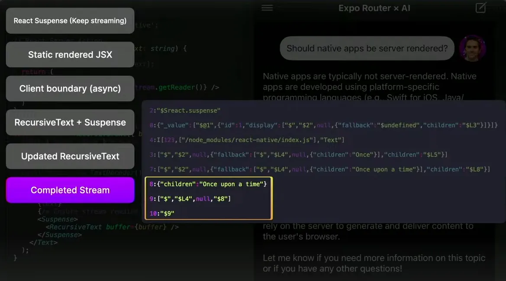
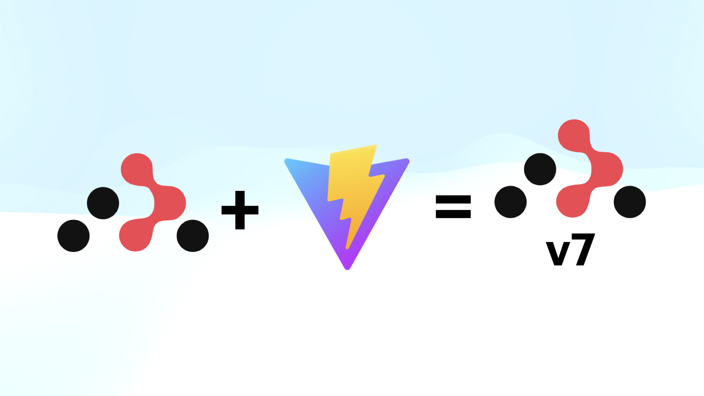
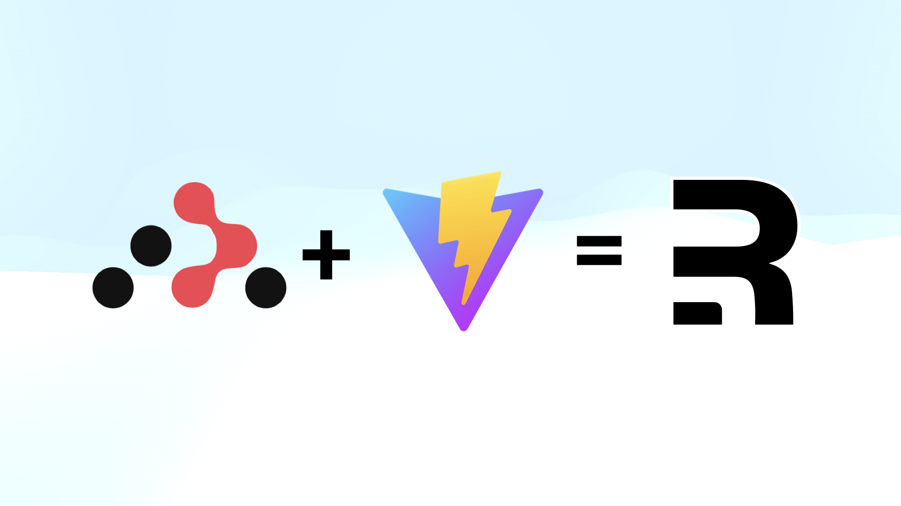

Hey **React Native** Developers,

The biggest **React** Conference, organized by [**Meta**](https://x.com/Meta) and [**Callstack**](https://x.com/callstackio), wrapped up recently. It was a two-day event that started on May 15th, filled with exciting announcements. Let’s dive in 🚀

1. React 19 RC (Release Candidate)
2. React Server Components in Expo Router 🔥
3. React Compiler 🚀
4. React Router v7
5. React Native for Apple Vision Pro


Picture credit by [@mattcarrollcode](https://x.com/mattcarrollcode)

# React 19 RC

React team announced React 19 as RC (Release Candidate) which means React 19 will be stable in the next few weeks. Also, react 19 RC is now available on npm as V**18.3.** One of the most exciting parts of React 19 is that RSC (React Server Component) is now stable and will not break between major versions. Let’s explore RSC in-depth. 🚀

### What is RSC?

RSC (React Server Component) is a rendering technique where the Server can send fully interactive, dynamic UI components (Ex: custom sliders) to the client (web, desktop, or Mobile device).

RSC allows developers to write components that render on both the **server** and the **client**. It also allows for selective rendering of components on the server, which means only the necessary components are rendered, reducing the server’s computational load. In RSC, initial rendering happens on the server, improving performance and reducing user wait time.

In the next section, we will learn more details about how RSC works from [Evan Bacon](https://x.com/Baconbrix)'s talk.

**`NOTE:`** 2 more rendering techniques in React World came before the birth of RSC.

- Client Side Rendering (CSR)
- Server Side Rendering (SSR)

### Client Side Rendering (CSR)

In this rendering technique, the final HTML content and user interface (UI) components are generated on the client's browser or Mobile app using JavaScript.

Client-side rendering can cause slow performance and SEO issues, so SSR (Server Side Rendering) came to improve loading times and page visibility for search engines.

### Server Side Rendering (SSR)

This rendering technique is used in web development where the web page's content is rendered on the server instead of the client's browser & then sent to the device as JSON (a static UI representation) which makes the UX (user experience) faster page transitions & better SEO.

Pretty cool **SSR**, right? But wait, did you notice that in the line above, we mentioned **SSR uses JSON** (basically HTML)? Yes, that **JSON** is not interactive. So, to create a dynamic and interactive UI, RSC came into the spotlight 💯.

# React Server Components in Expo Router

So, the most exciting news from **React Conf 2024** is that [**Evan Bacon**](https://x.com/Baconbrix) from the [**Expo**](https://x.com/expo) team has introduced **React Server Components** across all platforms (web, desktop, mobile) via the **Expo Router**.

To learn more about this talk, let’s first understand what the Expo Router is.

### The Expo Router

Expo Router is the first file-based routing system to build react apps that run on both web & native platforms.


With the help of **Expo Router**, the RSC server can handle multi-platform requests. When a request is made from an iOS or Android device, or even from a web browser, the server recognizes the platform and renders the appropriate version of the server components.

### Server-driven UI: RSC

There are some mobile apps (e.g., Lyft, Netflix, Reddit) that implement a server-driven UI in their native applications, which can be quite complex to configure. They are using some common architecture such as JSON (a static UI representation by HTML for a custom native application). However, this JSON does not facilitate **user interaction** with the UI.

Here, **RSC** (React Server Components) **has** advanced this concept by directly sending JSX components from the server to the client (web, desktop, or mobile device) to handle user interactions.

### RSC with Expo Router

The main goal of Expo Router is to make this server-driven UI interactive for developers. Below, we see three mobile applications that were showcased at the conference.

1. **ChatGPT 4 App:** It utilizes a server-driven UI with JSON. Since JSON is a static UI representation, it does not allow users to interact with the UI (e.g., clicking a button to reveal more data about an image).
2. **Gemini AI App:** It is the same as the ChatGPT 4 application.
3. **Expo Router AI App:** It also uses Server-driven UI but with an RSC data pattern (where server sends directly JSX code to the client device). This enables users to interact with the UI seamlessly. For instance, Evan Bacon demonstrated this by performing a long press on an image, which then opened a menu. Moreover, the RSC data pattern allows for the integration of native access, such as scheduling a date in the calendar, with the rendered JSX component.

.gif>)

In the Expo Router AI app, we observed Evan Bacon demonstrating a Map view (below). This Map view is a client component because it relies on the Native API. However, all the data for this Map was fetched on the server, and the carousel at the bottom, which we also received, was rendered using a React Server Component.

 (1) (1).gif>)

**`NOTE:`** The RSC server sends only JavaScript code to the client. It does not transmit any native bindings or native code (for example, Calendar API, Map API, etc.) to the client’s device.

Now, let’s learn a bit about the data pattern that RSC uses.

### RSC data pattern

When a **client** (web or mobile device) requests the Server then an **`RSC payload`** (static representation of the JSX code) is sent back with suspense (**loading components**) to keep the stream open.


These are the key points that an **RSC payload** carries and executes during the stream’s progress:

1. It carries the root **`JSX code`** in a static representation (JSON) format.
2. It then carries a **`URL`** that contains only the **client code** **(Client JS bundle),** which is necessary for RSC to load (hydrate) to be interactive for handling user actions.
3. Subsequently, it carries the currently rendered **`UI element`** (Ex: Text element). React’s Suspense feature is used here to ensure that the server can keep sending updates to the client (Ex: At first server sent **“Once”** and then sent **“Once upon a time”**). As more data is sent from the server to the client, the page or screen can keep updating with new content by updating the react tree. This continuous update process enables the client application to respond instantly to user interactions, resulting in a seamless experience.
4. Finally, once the stream is complete, React will terminate the connection.

Below is the final data pattern illustrating how the **RSC server** transmits data to the client (web, desktop, or mobile), as presented by **Evan Bacon** on stage.



# React Compiler

Finally, the **React team** has announced an experimental release of the **React compiler** 🚀. The community has made huge comments on this. Let’s explore it more here.

It is a build-time-only tool that automatically optimizes your React application. It works with plain JavaScript and understands the **Rules of React** (which we will discuss later), so there’s no need to rewrite any code to use it. If it detects violations of the rules, it will automatically skip those specific components or hooks and continue to compile the rest of the code safely.

### How does React Compiler work?

To optimize applications, the **`React Compiler`** automatically memoizes your code. You may already be familiar with memoization through APIs such as **`useMemo`**, **`useCallback`**, and **`React.memo`**. With these APIs, you can inform React that certain parts of your application don’t need to recompute if their inputs remain unchanged, thereby reducing the workload during updates. If your codebase is already well-memoized, you might not see significant performance improvements with the compiler.

### What React Compiler memoize?

The initial release of the React Compiler is primarily focused on these two areas to improve app performance by memoization.

1. Skipping all **`<Child/>`** components from re-rendering when **`<Parent/>`** component state got updated.
2. Memoizing all expensive calculations.

### Points to remember

Let’s see the below code snippet:

```javascript
// **Not** memoized by React Compiler, since this is not a component or hook
function expensivelyProcessAReallyLargeArrayOfObjects() {
  /* ... */
}

// Memoized by React Compiler since this is a component
function TableContainer({ items }) {
  // This function call would be memoized:
  const data = expensivelyProcessAReallyLargeArrayOfObjects(items);
  // ...
}
```

- React Compiler only memoizes React **components** and **hooks**, not every function: In this above code, we see that function **`expensivelyProcessAReallyLargeArrayOfObjects()`** will not be memoized by React Compiler as it is not a component (react component returns a React element) nor a hook (hook manage states). The function in this case is just processing an array of objects.
- The React Compiler’s memoization works separately for each component or hook: If you have a function like **`expensivelyProcessAReallyLargeArrayOfObjects()`** that’s used in several places, it will do the same heavy calculation each time, even if you’re passing the same data.

### Rules of React

Let’s easily understand which React rules should be followed to fully achieve the power of the React Compiler.

- **Components and Hooks must be pure:** Below are the conditions to be pure.
  - Always produce **the same output** given the same inputs.
  - **No side effects** (Ex: API calls, setTimeout, setInterval, etc) during the rendering phase.
  - Component **Props** and **states** can’t be mutated (changed) directly.
  - **Return values** and **arguments** to Hooks are immutable (read-only).
  - Don’t mutate (change) values after they’ve been used in JSX.
- **React calls Components and Hooks**
  - Don’t call components like regular functions (Ex: Don’t call by Component(). Instead, call it by `<Component/>`).
  - Hooks should only be called inside of components.
- **Rules of Hooks**
  - Only call Hooks at the top level of the component
  - Don’t call Hooks from regular JavaScript functions.

# React Router v7

**Another piece of good news is that [Ryan Florence](https://x.com/ryanflorence)** has introduced the world to **`React Router V7`**. In this new version 7, the **`Remix`** team has integrated **`Vite Plugin`** (a modern front-end build tool) with **`React Router`**. As a result, if you are using React Router V7 in your project, all these features will become available to you.

- Automatic code splitting
- Simplified data loading
- Form Actions, Server actions
- Simplified pending states
- Optimistic UI (UI acts before server confirms action)
- Server rendering
- Static pre-rendering (Builds static pages early for speed/SEO)
- RSC (React Server Component) coming soon



To know more about it, let’s first understand what React Router is.

### The React Router

**`React Router`** is the core library that provides the fundamental building blocks for routing in React applications. It contains components like **`Route`**, **`Switch`**, and **`Router`** that are essential for managing routes in any React project.

**`react-router-dom`** is the library that react team uses as the default routing library in react projects. It includes everything from **`React Router`** plus more features that are useful for web applications (Ex: **`BrowserRouter`** and **`Link`**).

Both **`React Router` & `react-router-dom`** were built by the [**Remix**](https://x.com/remix_run) team.

### Vite Plugin for Remix

In October 2023, the remix team integrated **`Vite`** with **`Remix`** (a **full-stack web framework** built on top of **`React Router`**). Then, in February 2024, the team announced **Vite Plugin** as stable in Remix v2.7.0.



At this point, **`Remix`** is just a **`Vite plugin`** that makes **`React Router`** more convenient to use and deploy. Outside of the plugin, **Remix** pretty much just re-exports **React Router**.

### The React Router V7

After integrating **Vite Plugin** with **Remix** **framework**, the team observed that **`React Router`** is already being used by more than **7 million** projects and **5 million** lines of the Shopify app. Therefore, the team didn’t want the developers of these projects to have to rewrite code to import **`Remix`** to achieve the features listed above.

So, they again took a new plan to help these millions of developers by remixing **`React Router`**. They just integrated **`Vite Plugin`** with **React Router** which means React Router is getting everything great about Remix (and more!) in the V7.

# React Native for Apple Vision Pro

Another piece of good news is that [**Michal**](https://x.com/thymikee) from [**Callstack**](https://x.com/callstackio) has introduced the React world to the [**`react-native-visionos`**](https://github.com/callstack/react-native-visionos) SDK for Apple Vision Pro. It’s a great contribution from [Oskar](https://x.com/o_kwasniewski), who has conducted very thorough research on it over the past few months 💯.

### React Native VisionOS

React Native visionOS is an out-of-tree platform that forks from the React Native core, extending its possibilities to new platforms. Examples of such projects include [React Native Windows](https://github.com/microsoft/react-native-windows), [React Native macOS](https://github.com/microsoft/react-native-macos), and [React Native tvOS](https://github.com/microsoft/react-native-macos).

### Start with Apple Vision Pro using React Native

You don’t need an Apple Vision Pro to make apps; using a simulator is enough. To create a new project you can use the React Native Community CLI:

```bash
npx @callstack/react-native-visionos@latest init NotJustDevVisionApp
```

### Live Demo

[**Michal**](https://x.com/thymikee) presented a live demo in which he loaded a 3D element with an impressive space background, powered by JavaScript, React Native Gesture Handler, and React Native Reanimated. 🚀

 (1) (1).gif>)

# **That’s it 🙌**

React Conf 2024’s key announcements included the **open-sourcing of the React Compiler**, the release candidate for **React 19**, **React Server Components (RSC)** in **Expo Router**, and **React Router v7**, among other updates.

### [🙏 If you find my R&D helpful, please give a STAR ⭐️](https://github.com/anisurrahman072/React-Native-SDK-Research)
